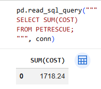
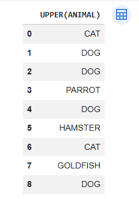
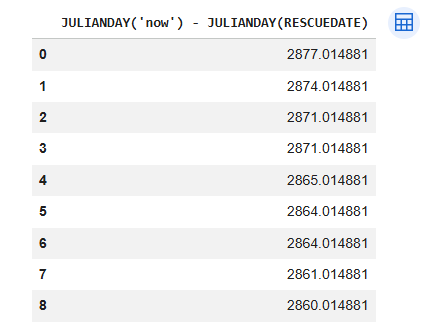

# pet-rescue-sql-functions
Applied SQL aggregate, string, and date functions to analyze pet rescue data using SQLite in Google Colab
# Pet Rescue SQL Functions

This project demonstrates SQL aggregate, scalar, string, and date functions using a pet rescue dataset. The analysis was performed in Google Colab using SQLite.

---

## Dataset

The dataset contains information about rescued animals, including:

- Animal type
- Quantity rescued
- Cost of rescue
- Rescue date

---

## Data Setup

The PETRESCUE table was created and populated using an SQL script.

---

## Aggregate Analysis

This section explores SQL aggregate functions such as SUM, AVG, and MAX to analyze rescue costs and quantities.

---

## String & Scalar Functions

This section demonstrates string and scalar functions such as UPPER, LOWER, LENGTH, and ROUND.

---

## Date & Time Analysis

This section applies SQLite date functions such as STRFTIME, DATE, and JULIANDAY to analyze rescue timelines.

---

## Key Learnings

- Practiced SQL aggregate functions (SUM, AVG, MAX)
- Used string and scalar functions (UPPER, LOWER, LENGTH, ROUND)
- Applied date functions using SQLite (STRFTIME, DATE, JULIANDAY)
- Gained experience working with structured datasets in SQL

---

## Author

Diane King
